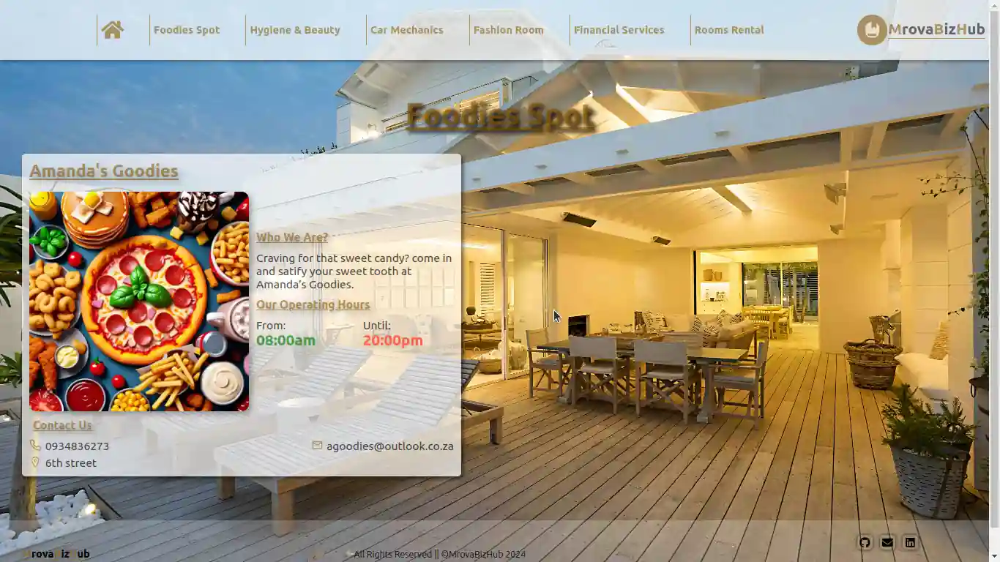

# MrovaBizHub

Check it _**LIVE**_ 👉
**<https://deebest.github.io/mrovaBizHub/>**

A multi page web application I built with the MERN stack. It's serves as a guid for people in my community who are looking for a certain business in the area. The businesses are stored on Mongodb and I use Express and Node to fetch them and then use React for the frontend of this app.

## Uses

Members of the community can visit the web app and find information about the business they need assistance from.

## Tech Stack Used

- GIT
- HTML
- CSS
- JavaScript
- React
- Node
- Express
- Mongodb
-

## Get In Touch 👇

Email : **<simphiwedladla8@gmail.com>**

Linked: **<https://www.linkedin.com/in/dladla-simphiwe-89061a20a/>**

Github: **<https://github.com/DeeBest>**

Portfolio: **<https://deebest.github.io/personal-webpage/>**

## Credits

images from the FakeStore api, link below.
**<https://fakestoreapi.com/>**
